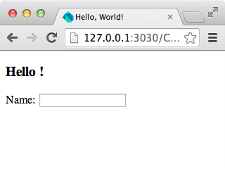
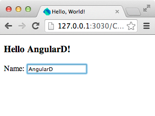

# 创建你的第一个应用

在这个章节中, 你将会利用 "Hello World" 这个应用来学习 Angular.dart 应用的基本结构, 如何绑定 (bind) model 到 view, 以及如何使用 Angular 内置的一些指令 (directive).

### 运行示例应用

本章节的代码可以在示例代码的 *[Chapter_01](https://github.com/angular/angular.dart.tutorial/tree/master/Chapter_01)* 目录下找到. 在 Dart Editor 里通过 **File >> Open Existing Folder...** 打开 **Chapter_01** 来查看它.

现在开始运行这个应用. 在 Dart Editor 的 Files 面板内, 选中 **Chapter_01/web/index.html** 文件, 右键, 然后点击 **Run in Dartium**.

> **提示:** 尽管 Angular.dart 的应用可以任何现代浏览器内, 但是现在, 我们推荐你暂时使用 Dartium. [稍后](./09-ch07-deploying-your-app.html), 你将会学习到如何去生成现代浏览器可运行的 JavaScript 文件.

Dartium 启动后, 应用成功的运行了. 当你在输入框打字的时候, 输入的所有字符都会显示在标题上.

 

> **提示:** 你可能注意到了, 在应用第一次启动的时候, *{{name}}* 显示了出来然后又消失了. 别担心, [稍后](./07-ch05-filter-service.html)你将会学习到如何使用 `ng-cloak` 去隐藏未编译过的 DOM 中的值.

### 让 Angular 的库在应用中可用

Dart 通过 **pubspec.yaml** 文件来定义应用的依赖包. 这里是当前示例中最简单的 pubspec.yaml 文件定义:

``` yaml
name: tutorial
version: 1.0.0
dependencies:
  angular: "1.0.0"
  web_components: ">=0.8.0 <0.9.0"
  browser: ">=0.10.0+2 <0.11.0"
transformers:
- angular
```
